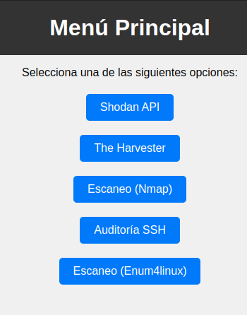
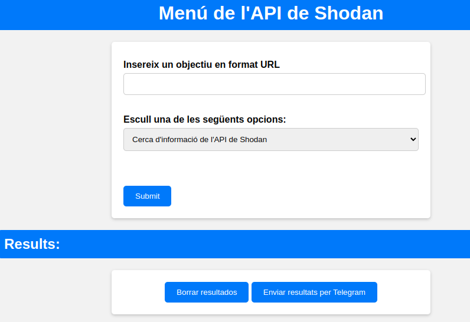
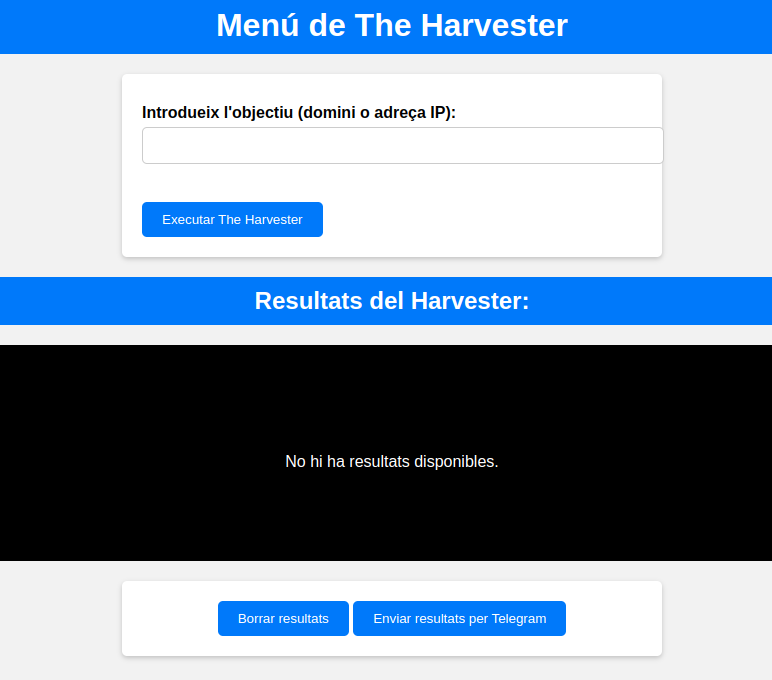
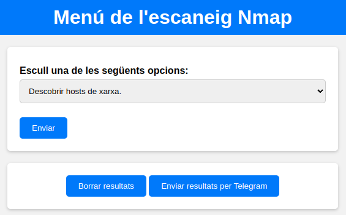
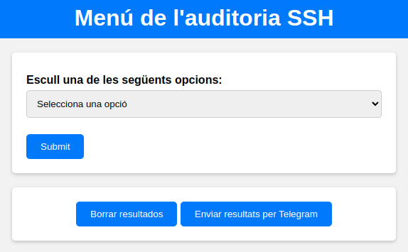
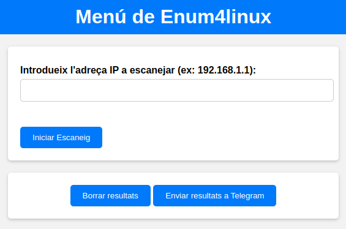

<h1 align="center">MIM Audit</h1>
<p align="center"></p> 

## Taula de continguts:
---

- [Descripció i context](#descripció-i-context)
- [Fet amb](#fet-amb)
- [Prerequeriments](#prerequeriments)
- [Guía de instalació](#guía-de-instalació)
- [Guía de usuari](#guía-de-usuari)
- [Codi de conducta](#codi-de-conducta)
- [Autor/es](#autores)
- [Licencia](#licencia)


## Descripció i context
---

Som un grup d'estudiants del IES Ebre. El nostre projecte (MIM Audit) es una eina que pot realitzar una auditoría a un host o xarxa. 

Funcionalitats principals
* Shodan API
* The Harvester
* Escaneo (Nmap)
* Auditoria SSH
* Enum4linux
* Enviar els resultats a Telegram
* Imatge del contenedor docker

## Fet amb

<p align="center">


</p>

<p align="right">(<a href="#readme-top">back to top</a>)</p>

## Prerequeriments
---
* Instal·lació de python i altres requeriments.

    ```
    pip install -r requirements.txt
    ```
 	
## Guía de instalació
---
1. Clona aquest repositori a la teva màquina local:
    ```
    git clone https://github.com/IsaacAndreu/MIM-Audit
    ```
2. Entra al directori del projecte:
    ```
    cd MIM-Audit
    ```
3. Instal·la les dependencies necessaries:
    ```
    pip install -r requeriments.txt
    ```

## Guía de usuari
---
Benvinguts a la secció d'ús de la nostra eina de auditoria. Aquí us guiarem a través dels passos bàsics per utilitzar les diferents eines disponibles a la nostra aplicació.

### Menú principal
En aquesta pantalla hi trobareu un menú amb les diverses eines de auditoria com Shodan API, The Harvester, Escaneo(Nmap), Auditoria SSH i Escaneo (Enum4Linux)

<p align="center">
  
</p>

### Instruccions generals
Cada eina té una secció on podeu introduir la IP o URL que volveu analitzar. Algunes eines tenen una barra de selecció perquè pugueu triar entre diferents funcions. Assegureu-vos de proporcionar la informació correcta abans de procedir.

### Shodan API
Comencem amb Shodan API. Introduïu la IP o URL a la barra corresponent. Podeu triar diferents opcions de cerca mitjançant la barra de selecció. Un cop fet, feu clic a "Enviar" i espereu els resultats a la part inferior. 

<p align="center">
  
</p>

### The Harvester
Amb The Harvester, introduïu la IP o URL desitjada i seleccioneu les opcions necessàries. Cliqueu "Executar The Harvester" per iniciar l'eina. Els resultats hi tarden uns 3 o 5 mins en mostrarse a la part inferior de la pàgina.

<p align="center">
  
</p>

### Escaneig (Nmap)
Amb Nmap primer elegiu una de les opcions, una vegada fet aixo introduïu la IP o nom del host que voleu escanejar i trieu les opcions de l'escaneig. Cliqueu a "Enviar" per iniciar el procés. Els resultats es mostraran sota la barra d'opcions

<p align="center">
  
</p>

### Auditoria SSH
En aquesta secció, primer elegiu una de les opcions, una vegada fet aixo introduïu la IP o host corresponen a la màquina amb la qual voleu realitzar l'auditoria SSH. Cliqueu a "Iniciar Auditoria". Els resultats apareixeran a sota.

<p align="center">
  
</p>

### Escaneig (Enum4Linux)
Per a l'escaneig amb Enum4Linux, introduïu la IP i cliqueu a "Iniciar Escaneig". Els resultats estaran disponibles a la part inferior.

<p align="center">
  
</p>

### Resultats
Després de completar cada anàlisi, veureu els resultats a la part inferior de la pàgina. Teniu un botó per esborrar els resultats si cal, i també un botó per enviar-los via Telegram.

### Suport tècnic
No dubteu a explorar les diferents eines i funcions per millorar la vostra auditoria. Si teniu algun dubte, consulteu la nostra secció de preguntes freqüents o poseu-vos en contacte amb el nostre suport tècnic. Gràcies per confiar en la nostra plataforma.


## Codi de conducta
---
Podeu trobar el codi de conducta al següent link: https://github.com/IsaacAndreu/MIM-Audit?tab=coc-ov-file

## Autor/es
---
Marc Queral - (https://github.com/MarcQueral)

Isaac Andreu - (https://github.com/IsaacAndreu)

Max Segura - (https://github.com/MaxSegura)

Link del projecte: [https://github.com/IsaacAndreu/MIM-Audit]

## Licencia 
---

MIT License

Derechos de autor (c) 2024 MIM Audit

Se concede permiso, de forma gratuita, a cualquier persona que obtenga una copia
de este software y de los archivos de documentación asociados (el "Software"), para tratar
en el Software sin restricciones, incluidos, entre otros, los derechos
de usar, copiar, modificar, fusionar, publicar, distribuir, sublicenciar y / o vender
copias del Software, y permitir a las personas a las que se les proporcione el Software
hacerlo, sujeto a las siguientes condiciones:

El aviso de copyright anterior y este aviso de permiso se incluirán en todos
copias o partes sustanciales del Software.

EL SOFTWARE SE PROPORCIONA "TAL CUAL", SIN GARANTÍA DE NINGÚN TIPO, EXPRESA O
IMPLÍCITA, INCLUYENDO PERO NO LIMITADO A LAS GARANTÍAS DE COMERCIABILIDAD,
IDONEIDAD PARA UN PROPÓSITO PARTICULAR Y NO INFRACCIÓN. EN NINGÚN CASO LOS
AUTORES O TITULARES DE LOS DERECHOS DE AUTOR SERÁN RESPONSABLES DE CUALQUIER RECLAMO,
DAÑO U OTRA RESPONSABILIDAD, YA SEA EN UNA ACCIÓN DE CONTRATO, AGRAVIO O DE OTRA MANERA,
PROVENIENTE DE, FUERA DE O EN RELACIÓN CON EL SOFTWARE O EL USO U OTROS
OPERACIONES EN EL SOFTWARE.
