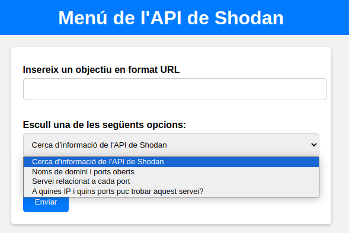
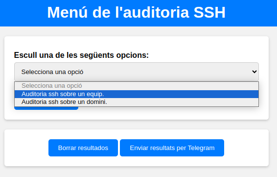
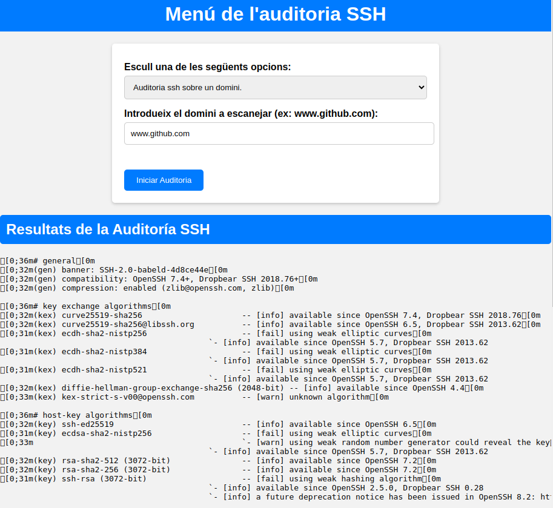

<h1 align="center">MIM Audit</h1>
<p align="center"></p> 

## Taula de continguts:
---

- [Descripció i context](#descripció-i-context)
- [Fet amb](#fet-amb)
- [Prerequeriments](#prerequeriments)
- [Guía de instalació](#guía-de-instalació)
- [Guía d'usuari](#guía-d'usuari)
- [Codi de conducta](#codi-de-conducta)
- [Autor/s](#autors)
- [Licencia](#licencia)


## Descripció i context
---

Som un grup d'estudiants de l'institut IES de l'Ebre. El nostre projecte (MIM Audit) es una eina que pot realitzar una auditoría a un host o xarxa amb l'utilitat de diferents funcions. 

Funcionalitats principals
* Shodan API
* The Harvester
* Escaneig (Nmap)
* Auditoria SSH
* Enum4linux
* Enviar els resultats a Telegram
* Imatge del contenedor docker

## Fet amb

<p align="center">


</p>

## Prerequeriments
---
* Instal·lació de python i altres requeriments.

    ```
    pip install -r requirements.txt
    ```
 	
## Guía d'instal·lació
---
1. Clona aquest repositori a la teva màquina local:
    ```
    git clone https://github.com/IsaacAndreu/MIM-Audit
    ```
2. Entra al directori del projecte:
    ```
    cd MIM-Audit
    ```
3. Instal·la les dependencies necessaries:
    ```
    pip install -r requeriments.txt
    ```

## Guía d'usuari
---
Benvinguts a la secció d'ús de la nostra eina d'auditoria. Aquí us guiarem a través dels passos bàsics per utilitzar les diferents eines disponibles a la nostra aplicació.

### Menú principal
Aquesta pantalla és la pestanya principal que s'obri quan ecexutem el codi. En aquesta podem trobar un menú amb les diverses eines d'auditoria com Shodan API, The Harvester, Escaneig (Nmap), Auditoria SSH i Escaneig (Enum4Linux).

Quan es prem el botó corresponent es realitza una redirecció a l'eina d'auditoria amb la qual es vol treballar.

<p align="center">
  
</p>

### Instruccions generals
Cada eina té una secció on podeu introduir la IP o URL que volveu analitzar. Algunes eines tenen una barra de selecció perquè pugueu triar entre diferents funcions. Assegureu-vos de proporcionar la informació correcta abans de procedir.

### Shodan API
Comencem amb Shodan API. 

Aquesta és a la pàgina que es fa la redirecció quan es prem el botó de Shodan API al menu principal de la pàgina web. 

<p align="center">
  
</p>

Dins d'aquesta pots fer diferentes funcions ja que quan obris el desplegable pots escollir quin escaneig realitzar amb Shodan. Els anàlisis sobre una IP o un domini amb Shodan poden ser 4: informació de l'API de Shodan, noms de domini i ports oberts, servei relacionat a cada port i escaneig de IP i ports sobre un servei.

<p align="center">
  
</p>

Un exemple seria el que mostrem a la imatge de sota. Com es pot comprovar introduïm el domini www.facebook.com i com a resultat ens mostra informació rellevant sobre aquest.

<p align="center">
  
</p>

### The Harvester
Amb The Harvester, d'entrada ens demana introduïr una IP o URL objectiu per realitzar l'auditoria. Com a resultat ens mostra un escaneig bastant extens amb molta informació interessant sobre el domini introduit.

<p align="center">
  
</p>

Com aquesta eina es tant completa, tarda uns 3min en realitzar l'escaneig però l'espera val la pena!!

A continuació es pot veure un simple exemple sobre la utilitat de The Harvester sobre el domini www.iesebre.com

<p align="center">
  
</p>

### Escaneig (Nmap)
Amb Nmap es poden escollir fins a 4 funcions diferents. Aquestes són bastant útils per fer una auditoria ràpida a un equip o domini en concret. 

<p align="center">
  
</p>

Per fer la selecció de l'escaneig que es vol dur a terme, hi ha un desplegable el qual explica detalladament cada funció. Aquesta eina ens permet fer una cerca de hosts dins d'una xarxa, escaneig de ports oberts, serveis i versions de ports i també es pot extreure un llistat de vulnerabilitats.

<p align="center">
  
</p>

Com us mostrem a la imatge de sota, es pot apreciar un escaneig sobre un equip de serveis i versions dins d'un rang de ports.

<p align="center">
  
</p>

### Auditoria SSH
En aquesta secció, es pot fer una auditoria SSH la qual mostra com a resultat la seguretat de la configuració del servidor SSH que s'ha escanejat.

<p align="center">
  
</p>

Dins de la seva pàgina inicial, es pot veure un desplegable el qual permet fer una tria de dos opcions: auditoria SSH sobre un equip i també sobre un domini.

<p align="center">
  
</p>

Per a que veigueu el seu ús, aqui us mostrem una auditoria sobre el domini www.github.com

<p align="center">
  
</p>

### Escaneig (Enum4Linux)
Per acabar amb les diferents auditories que hem implementat, hem introduit l'eina d'escaneig Enum4Linux. Aquesta està dissenyada per a l'enumeració d'informació en sistemes que executen el protocol SMB. A la imatge de sota es pot veure la pàgina principal d'aquesta secció.

<p align="center">
  
</p>

Amb Enum4Linux hem implementat nomès una funció ja que és la més útil i interessant. Aquesta realitza un escaneig sobre un equip on nomès s'ha d'indicar la seva adreça IP. A la imatge de sota es pot veure un exemple molt senzill.

<p align="center">
  
</p>

### Suport tècnic
No dubteu a explorar les diferents eines i funcions per millorar la vostra auditoria. Si teniu algun dubte, consulteu la nostra secció de preguntes freqüents o poseu-vos en contacte amb el nostre suport tècnic. Gràcies per confiar en la nostra plataforma.


## Codi de conducta
---
Podeu trobar el codi de conducta al següent link de GitHub: https://github.com/IsaacAndreu/MIM-Audit?tab=coc-ov-file

## Autor/s
---
Marc Queral - (https://github.com/MarcQueral)

Isaac Andreu - (https://github.com/IsaacAndreu)

Max Segura - (https://github.com/MaxSegura)

Link del projecte: [https://github.com/IsaacAndreu/MIM-Audit]

## Licencia 
---

MIT License

Drets d'autor (c) 2024 MIM Audit

Es concedeix permís, de forma gratuïta, a qualsevol persona que n'obtingui una còpia
d'aquest programari i dels fitxers de documentació associats (el "Software"), per tractar
al Programari sense restriccions, inclosos, entre altres, els drets
d'usar, copiar, modificar, fusionar, publicar, distribuir, subllicenciar i/o vendre
còpies del Programari, i permetre a les persones a les quals se'ls proporcioni el Programari
fer-ho, subjecte a les següents condicions:

L'avís de copyright anterior i aquest avís de permís s'inclouran a tots
còpies o parts substancials del Programari.

EL PROGRAMARI ES PROPORCIONA "TAL QUAL", SENSE GARANTIA DE CAP TIPUS, EXPRESSA O
IMPLÍCITA, INCLÒS PERÒ NO LIMITAT A LES GARANTIES DE COMERCIABILITAT,
IDONEÏTAT PER A UN PROPÒSIT PARTICULAR I NO INFRACCIÓ. EN CAP CAS ELS
AUTORS O TITULARS DELS DRETS D'AUTOR SERAN RESPONSABLES DE QUALSEVOL RECLAM,
DANY O UNA ALTRA RESPONSABILITAT, JA SIGUI EN UNA ACCIÓ DE CONTRACTE, AGRAVI O D'ALTRA MANERA,
PROVINENT DE, FORA D'O EN RELACIÓ AMB EL PROGRAMARI O L'ÚS O ALTRES
OPERACIONS AL PROGRAMARI.
